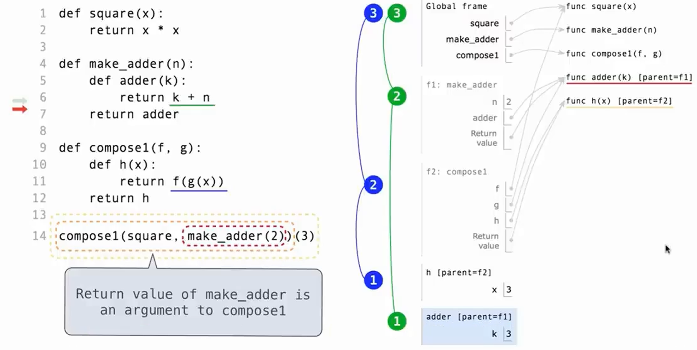

# CS61A

## Lecture 2: Functions

### Expression
- Primitive expression: number, name, string, etc.
- Assignment expression: bind value to a name, we can also bind a function to a name
    ```python
    f = max
    f(a,b)
    ```
    > 可见函数在python中是first class value，即可以像其它value一样被赋值、作为参数和返回值。
- Call expression: consist of operator(like name of a function) and operand(like argument/parameter of a function).使用call expression时从左到右依次evaluate operator和operands。

### Function
- funcition definition: def expression
    - function signature: consist of function name and formal parameter

- function calling
    1. add a local frame using the function signature(thus forming a new environment)

        > frame即局部作用域，变量只在内部起作用，全局变量所在的frame称为global frame；environment是许多frame的序列，如在执行某函数`f`时，局部变量所在的environment就是f frame-global frame。某个frame可以谈论其parent frame

    2. bind the formal parameters to the arguments

        > 每个expression都在特定的environment下被evaluate，即在evaluate一个name时，会将其evaluate到当前环境中该name出现的最近的frame中该name的值（即变量只在局部作用域取值）

- return value
    - 不返回任何value的函数返回 `None`(属于NoneType)
    - 若函数的唯一效果是返回一个value，则称为pure function；若有额外效果，则称为Non-pure function

## Lecture 3: Control

### Python in Bash

- 以交互模式运行Python并执行文件：
    ```bash
    python3 -i ex.py
    ```
- 在python函数中写包含doctest的注释文档：
    ```python
    def max(a, b)
        """
        >>> max(1, 2)
        >>> 2
        """
        if(a > b):
            return a
        else:
            return b
    ```
    并在bash中运行该测试来检测函数是否能实现正常功能：
    ```bash
    python3 -m doctest max.py
    ```

### Boolean contexts
- 条件语句中被判断的部分称为Boolean context
    - 假值包括：`False`,`0`,`''`,`None`；真值是其它value
    - assert statement: 通常用于对变量的取值做限制：
        ```python
        assert a > 0, 'a must be positive.' 
        ```
## Lecture 4: Higher-order function

- 高阶函数指形参或返回值是function name的函数，如
    ```python
    def make_area(prefactor):
        def area(r):
            return prefactor * r * r
        return area
    make_area(2)(3)

    def general_sum(n, term):
        total, k = 0, 1
        while(k <= n):
            total += term(k)
            k += 1
        return total
    ```
    > 高阶函数中会在函数体中定义函数，称为locally defined functions，只在其所在的函数对应的local frame中有效，所以local defined function和local frame一样也有parent的概念，其parent即为其def语句所在的local frame。

- 可变数量的参数列表`*args`
    ```python
    def printed(f):
        def print_and_return(*args):
            print('Result:', result)
            return result
        return print_and_return
    ```
    
## Lecture 5: environment

### 高阶函数的environment diagram

- 高阶函数中有嵌套def语句时environment diagram如下图所示

    

### Lambda expression

- 用于使用赋值语句而非def语句将函数bind到某个name上
    ```python
    square = lambda x: x * x
    (lambda x: x * x)(3)
    ```
    > 一般的function（包括build in function和user defined function都有intrinsic name，而lambda函数只会被显示为lambda，即其不像def语句在创建时就具有名字

### Function Currying

将多变量函数分解嵌套为单变量函数的过程称为currying，如
```python
def make_adder(n)
    return lambda k: n + k
make_adder(2)(3)
add(2, 3)
```
一般化可以写为

```python
def curry2(f):
    def g(x):
        def h(y)
            return f(x, y)
        return h
    return g
```

## Lecture 7: Functional Abstraction

### Function abstraction

> 将某个计算过程抽象成函数，只需要知道函数的输入（参数）和输出（返回值），而完全无需知道其具体实现。

### Errors and tracebacks

错误类型：
1. syntax error: 表达式形式不正确，执行前就能被python解释器发现
2. runtime error: 执行程序时被解释器发现，解释器会给出traceback（给出error发生时解释器正在做什么）
3. logical error: 不会被解释器发现

## Lecture 8: Function examples

### Decorators
装饰器是使用高阶函数的一个python特性。

```python
def trace1(fn):
    def traced(x)：
        print('Calling', fn, 'on argument', x)
        return fn(x)
    return traced

@traced1
def square(x):
    return x * x
```
等价于 
```python
square = trace1(square)
```